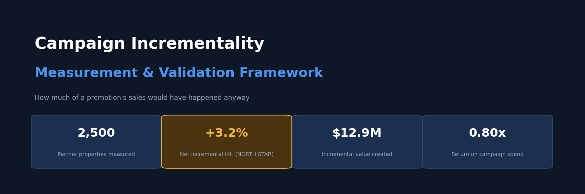
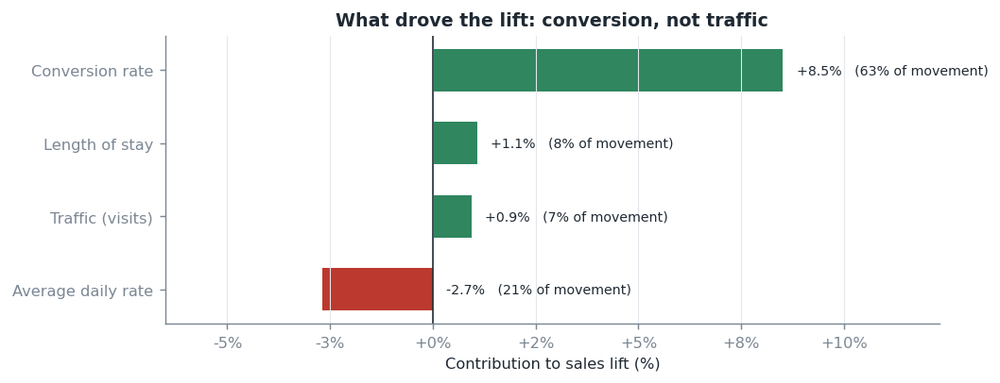
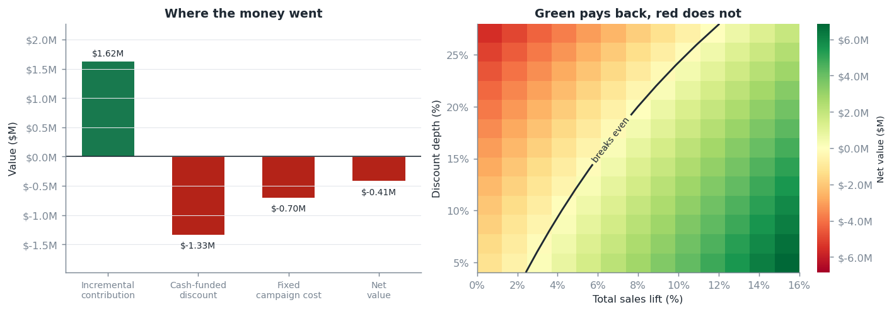

# Campaign Incrementality Measurement

**Aakanksha Baid** — Analytics Strategy Leader · [LinkedIn](https://www.linkedin.com/in/aakankshabaid/) · [GitHub](https://github.com/AakankshaBaid)



> Built on **simulated data** with a known correct answer, so the method's accuracy can be proven. No confidential data appears anywhere in this repo.

---

## Executive Summary

**The question:** when we discount, how much of the extra business did we actually create — and did it pay for itself?

A mid-year promotion ran across 2,500 partner properties. Participating hotels sold **7.9% more**. But they took **4.1%** from the hotels next door, who were also ours. Netting that off:

| | |
| --- | ---: |
| Extra sales at participating hotels | **+$32.2M** |
| Sales taken from our other hotels | **−$19.3M** |
| **What we actually gained** | **+$12.9M** (+3.2%) |
| What we needed to break even | **+3.9%** |
| **Return on spend** | **0.80x** |

**The campaign did not pay back. Measuring only the participating hotels would have called it a clear win.**

Two numbers explain why, and both point to the same fix:

- **91% of the discount went to customers already buying.** Of $14.8M given away, $13.5M went to customers who would have booked anyway. The biggest cost lever isn't discount depth, it's who qualifies.
- **The deal converted existing visitors, it didn't attract new ones.** Conversion rose 8.5%; traffic rose only 0.9%. The campaign converted demand that had already arrived.

**The recommendation: narrow eligibility rather than deepen discounts, and screen campaigns against their break-even lift before committing spend.** Cutting the sales we cannibalise from ourselves by just a quarter, turns this campaign profitable.

---

## Business Problem

- Promotional campaigns commit significant discount and media spend, but reported lift includes demand that would have arrived anyway
- Campaigns run during seasonal peaks, so simple before-and-after comparison measures the calendar, not the campaign
- We can't run a clean A/B test — partners sign up contractually, and a price cut is visible to everyone
- **Campaigns run in every market at once**, so there is no untreated market to compare against
- Sales won from a competing property on our same platform look identical to new demand in every standard report

**The decision this supports:** how deep should the next promotion discount, who should be eligible, and should it run at all?

---

## North Star Metric

**Total incremental gross booking value versus the break-even lift.**

*Total* means participating hotels **plus** the effect on their competitors. *Incremental* means against a modelled baseline of what would have happened anyway. *Versus break-even* means a lift only counts as good news if it covers what it cost to produce.

**Current result: +3.2% against a 3.9% break-even.** Below the line.

---

## Skills

- Causal inference · incrementality measurement · marketing effectiveness · counterfactual modelling
- Experiment design · power analysis · test validation · minimum detectable effect
- KPI decomposition · driver attribution
- Unit economics · break-even analysis · promotional pricing
- Python · SQL · statistical modelling · simulation
- Executive communication · automated decision reporting

---

## Methodology


**We run two causal models, and add them together.**

1. **Participating hotels** — how much more did they sell than they would have?
2. **Their direct competitors** — what happened to the hotels next door?

The second number carries its own sign. If competitors *lost* business, the campaign moved sales rather than creating them, and it comes off. If competitors *gained*, the campaign lifted the whole neighbourhood, and it adds. 
| Compset model result | Meaning | Contribution |
| --- | --- | --- |
| Significantly positive | Halo — the campaign lifted neighbours too | **Adds** |
| Not distinguishable | Clean — no spillover | Zero |
| Significantly negative | Cannibalisation — sales moved rather than appeared | **Subtracts** |

**Choosing the comparison group.** This is the decision that matters most, because the promotion runs everywhere simultaneously, every untreated hotel still sits next to a discounted competitor. So the yardstick is **non-hotel bookings — flights, cars, activities.** They run in the same markets, move with the same travel demand week to week, and a hotel deal cannot discount them. Supporting signals are marketplace-wide demand: search clicks, metasearch, site traffic.

We also correct for last year's version of the same campaign. With high repeat participation the pre-period contains a treatment episode which sits inside the historical data and otherwise makes this year's result look smaller than it was.

---

## Results

| | Participating | Competitors | **Total** |
| --- | ---: | ---: | ---: |
| Sales lift | +7.9% | −4.1% | **+3.2%** |
| Value | +$32.2M | −$19.3M | **+$12.9M** |

Room nights rose **10.9%** while booking value rose 7.9% — the gap is the discount reaching travellers, which confirms the deal actually landed.

**Economics:** $1.62M gross profit generated against $2.03M of cost → **−$0.41M, a 0.80x return.**

**What drove the lift** *(Exhibit E)*



| Driver | Contribution |
| --- | ---: |
| **Conversion rate** | **+8.5%** |
| Length of stay | +1.1% |
| Traffic | +0.9% |
| Average price | −2.7% |

The deal persuaded people who were already browsing. It did not bring new people in. That means the lever is **eligibility**, not media spend.

Member-only stacked discounts add a further **+2.3%** where offered.

**Baseline vs actual** *(Exhibit C)* ·


**Lift build** *(Exhibit D)*


---

## Model Validation

Before reporting any number, the method checks its own assumptions and fails loudly if they don't hold.


| Check | Question | Result |
| --- | --- | --- |
| Comparable groups | Do the groups move together historically? | **Pass** — 0.99 |
| Predictor integrity | Was our control series affected by the campaign? | **Pass** |
| Quiet-period test | Does a period with no campaign read as no campaign? | **Pass** |

Then seven further tests, **all passing**: forecast accuracy (1.9% error), fake-campaign test, random-group test, competitor displacement, comparison-group contamination, relationship stability, and window cherry-picking.


### Where this method holds

The same approach across three campaigns:

| Campaign | Timing | Checks passed | Verdict |
| --- | --- | ---: | --- |
| **Mid-year sale** | off-peak | **10/10** | **Trust the number** |
| Black Friday | seasonal peak | 9/10 | Directional only |
| Spring sale | shoulder season | 8/10 | Not reportable |

**Peak-season campaigns move overall marketplace demand enough to contaminate the control series.** That is not a flaw to fix in the model — it is a limit of measuring a campaign big enough to move the whole market. Off-peak campaigns are where this method is on solid ground.

---

## Can This Campaign Be Made To Pay Back?

**Yes — and not by discounting differently.**

The campaign generated $32.2M at participating hotels and gave $19.3M of it straight back to their competitive set. **Self-cannibalisation, not cost, is what sank it.**

**Lever A —  target properties with less competitive overlap**

| Cannibalisation vs. observed | Total lift | Return |
| ---: | ---: | ---: |
| As run | +3.2% | 0.80x |
| **25% less** | +4.4% | **1.09x — profitable** |
| 50% less | +5.5% | 1.39x |
| None | +7.9% | 1.98x |

**Lever B — narrow eligibility**

| Share of bookings on the deal | Return |
| ---: | ---: |
| 34% (as run) | 0.80x |
| **18%** | **1.15x — profitable** |
| 12% | 1.38x |

**Both together: +5.5% lift, $1.42M profit, 2.01x return.**

One caveat: Lever B assumes demand stays fixed as we restrict eligibility. Tighten far enough and the lift will eventually shrink. Treat it as a decision boundary, not a forecast.

**Bottom line: this campaign was about 25% away from paying back, and the cheapest route there is choosing different participants.**

---

## Business Impact

*Simulated figures.*

- **Reversed the verdict.** A +7.9% participant lift reads as a win; total incrementality of +3.2% against a 3.9% break-even shows it lost money. **$19.3M of the apparent gain was business moved between properties already on our platform.**
- **Sized $13.5M of wasted discount** — 91% went to already-converting demand from customers.
- **Recovered 3 points of understated performance** by correcting for last year's campaign.
- **Established where measurement can be trusted**, so readouts now carry a confidence rating instead of an unqualified number.
- **Cut false "campaign worked" conclusions from 42% to 8%** by requiring results to be both statistically significant and commercially above break-even.

---

## Business Recommendations

1. **Narrow eligibility rather than deepening discounts.** Cutting self-cannibalisation by a quarter makes this campaign profitable.
2. **Report total incrementality, never the participant lift alone.** The gap was 4.7 points — the difference between a win and a loss.
3. **Screen campaigns against break-even lift before committing spend.** This campaign needed 3.9% and delivered 3.2%; the cost structure made that knowable in advance.
4. **Hold back a sample of competitive sets from the next campaign.** The single highest-value change available, and it's a campaign-planning decision, not an analytics one.
5. **Treat peak-season results as directional.** Report the confidence rating alongside the number.
6. **Require results to be significant *and* commercially meaningful.** A measurable 0.1% lift is not a business result.

---

## Scoping for a Phased Rollout

| Phase | Duration | Scope | Done when |
| --- | --- | --- | --- |
| **1. Foundation** | 4–6 weeks | Build the data view; agree comparison rules; backfill 18 months | Reconciles to finance within 0.5% |
| **2. Retrospective** | 4 weeks | Re-measure 4–6 past campaigns; quantify the gap vs old reporting | Checks pass on off-peak campaigns |
| **3. Parallel run** | One cycle | New readout alongside existing reporting | Stakeholders can explain the differences |
| **4. Production** | 6 weeks | Scheduled reporting, automated memos, pre-launch break-even screening | Readout within 5 working days of close |
| **5. Extension** | Ongoing | Holdout pilot; regional splits; discount elasticity | — |

Prove it on off-peak campaigns first, where the method is strongest. **Dependencies:** booking, traffic and competitive-set data; agreement to hold back a sample before launch.

---

## Next Steps

- Pilot a cluster-randomised holdout - sample of competitive sets which is worth more than any modelling change
- Close the remaining ~1.7 point conservatism in the estimate
- Measure repeat bookings after the campaign window; today's numbers are conservative
- Add regional and segment breakdowns
- Estimate discount elasticity, so the recommended depth becomes a forecast rather than a boundary

---

## FAQ

- **Why simulated data?** Because the true answer is known, the method can be proven to recover it. That is impossible on live data, where the right answer is exactly what you're trying to find.
- **Why not an A/B test?** Partners sign up contractually and a price cut is public. There is no clean group to hold back — which is why the next-campaign holdout is the top recommendation.
- **The campaign runs everywhere — so what do you compare against?** Not untreated hotels; none exist. From non-lodging product lines - Flights, cars and activities, which share the same travel demand but cannot be discounted by a hotel deal.
- **Why add the competitor effect instead of subtracting it?** Because its sign is the finding. Negative means we cannibalised ourselves; positive is halo means we lifted the neighbourhood.
- **Can this run on live data?** Yes — one data connection is swapped for the production query.

---

## Notes

Fully synthetic. No proprietary data appears here.

- **The estimate is conservative by roughly 1.7 points** and is reported as a floor, not a midpoint. The cause is identified and documented in the code.
- **Thresholds are calibrated on stable data, not chosen.** Where a check can only detect effects above a certain size, that limit is stated rather than implied.
- **One diagnostic is deliberately labelled weak.** Testing whether the control was itself affected can only rule out large contamination, so the risk is sized by sensitivity analysis instead of waved through.
- **Limitations.** Results exclude repeat bookings after the campaign. Partners opted in, so findings apply to those who took part. The eligibility recommendation assumes demand holds.

---

## Exhibits

| Exhibit | Description |
| --- | --- |
| **A** | Executive overview — headline figures |
| **B** | Methodology — the approach at a glance |
| **C** | What happened vs. what would have happened |
| **D** | How the lift built and faded |
| **E** | What drove the lift |
| **F** | Validation dashboard |
| **G** | Economics and break-even |
| **H** | Assumption checks |



Each run also writes a [one-page decision memo](outputs/mid_year_sale_2025_decision_memo.md) generated straight from the results, so no figure is ever re-typed.

---

## Repo Structure

```
.
├── configs/            One file per campaign — no code changes needed
├── src/incrementality/ Measurement engine, assumption checks, validation,
│                       driver decomposition, economics, reporting
├── studies/            Accuracy and assumption-sensitivity studies
├── sql/                Production query and data quality gates
├── tests/              45 automated tests
└── outputs/            Exhibits, tables and decision memos
```

## Running It

```bash
pip install -e ".[dev]"

make run         # measure the reference campaign, produce all exhibits
make all         # every campaign in configs/
make diagnose    # model adequacy, sensitivity and design ranking
make test        # 45 automated tests
```

Measuring a new campaign takes a short config file, not new code. Every figure is reproducible from a fixed seed, and all exhibits are committed — readable on GitHub without running anything.
